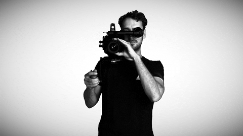

# 🎬 Getting the set up right

Getting the right equipment and platforms in place is going to set you well to deliver high quality, engaging classes. It will not only make you feel more confident delivering a live streamed class, but it will also boost the experience for your participants! 🤩

The sections to think through are:





