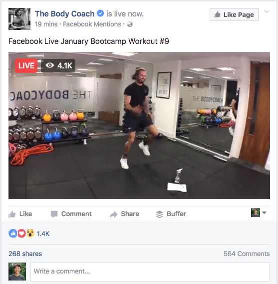

# Using Facebook Live


Facebook Live is a great option where you \(a\) offer free classes and \(b\) just want to get going. There are some setups where you could offer classes to paid-up members \(e.g. setting them up on a private Facebook Group\) so there is still some flexibility.


### 💷 Does it cost anything?

No. As long as you have laptop / smartphone, Internet access and a Facebook account \(free to set up\), you can start streaming your class on Facebook!

### 🙆‍♀️ What's it like for participants?

You'll need to tell participants to be logged-in to Facebook and on your Facebook Page / Group at the time you intend to start streaming. 

Participants will be able to post comments and share reactions, but you won't be able to see the participants themselves, which means you can't offer any direct motivation \("Great work, Priyanka! Get those legs higher, Donald!"\) or help correct on form or technique.

Some instructors also find it a bit tricky as there's no direct feedback from the class, which can feel a little off-putting as you're not sure if what you're doing is landing.

### 🎲 How do I get started with Facebook Live?

It's very simple - essentially, when you're ready to start streaming, sign into Facebook, select the Create Post option, click on the three dots, and select **Live Video.** This will open the Live Video Producer settings page - tweak the settings so it works best for you. When you're done and you're ready to start streaming, hit **Go Live!** 😼

In the Live Video Producer page, you'll see options of where to post. Depending on what you're aiming for, you probably want to post to a Group or Page that you manage. That way, when you're telling participants about the class beforehand, all you need to do is send them the URL for the Group or Page, and what time you'll be streaming.

There is an option to [stream classes from Zoom directly to Facebook Live](https://support.zoom.us/hc/en-us/articles/115000350406-Streaming-a-Meeting-or-Webinar-on-Facebook-Live) \(best of both worlds!\), but we only recommend you attempt this if you are confident with both Zoom, Facebook and tinkering around with platforms like this. 🤖

### 🎯 **Tips for using Facebook Live**

* If you're using Facebook Live, you might as well use Facebook for all of it's benefits - make sure you're posting regularly and making people aware of your upcoming classes. 
* If you want more engagement, answer the questions that people are sending in via the comments. Participants will realise you are doing this, they'll be more inclined to post \(which in turn raises your profile within Facebook to other potential new participants\). You can also acknowledge viewers as they join your broadcast, making your class more personal.

You can also use Facebook's own help pages if you run into difficulties:



