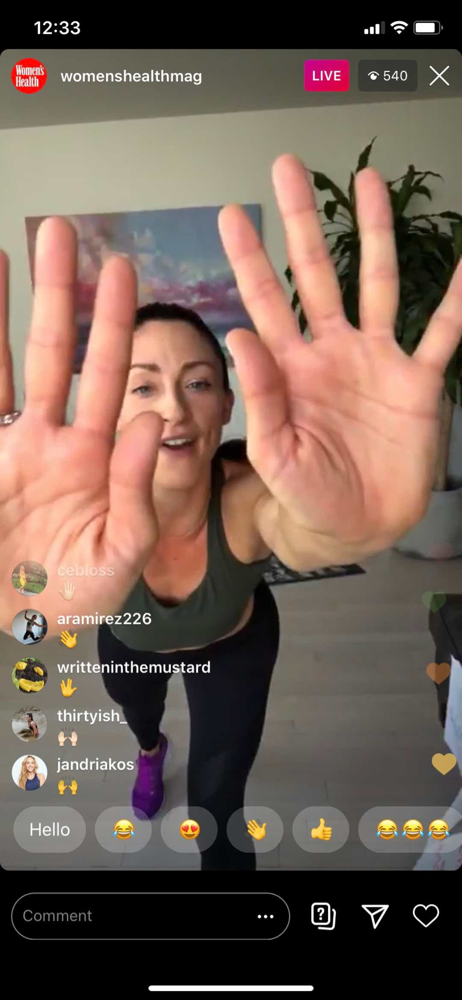

# Using Instagram Live


Very similar to Facebook Live, Instagram Live is another easy, quick way to get your free classes live streamed within minutes. Unlike Facebook Live, where there are a few workarounds for private Groups or Pages to limit access to those who have pre-booked / paid, Instagram Live really is only appropriate if you don't want to restrict who can join your class.


### 💷 Does it cost anything?

Nope! As long as you have an Instagram account and a smartphone to stream from, you can get going with Instagram Live.

### 🙆‍♂️ What's it like for participants?

You'll need to tell participants to be on your profile in the Instragram app or website at the time you want to start streaming. 

Participants will be able to post comments, but you won't be able to see them so you can't offer any direct motivation \("Hold for two more seconds, Svetlana!"\), nor help correct on form or technique.

Some instructors also find it a bit tricky as there's no direct feedback from the class, which can feel a little off-putting as you're not sure if what you're doing is landing.

### 🎲 How do I get started with Instagram Live?

Simple: sign into Instagram \(or create an account\) and from within the Instagram app, click on the camera icon in the top left of the feed, or just swipe right when you're looking at the feed.

At the bottom, if you scroll down, you'll see **Live** and you can tap the "broadcast" icon. You're now live streaming! 😎

Tell your participants what time you'll be live streaming on Instagram, and your Instagram handle name so they can find your profile.

### 🎯 **Tips for using Instagram Live**

* Don't forget to save your video once you're done, to re-use elsewhere. You can also share it to your Instagram profile for others to watch later. 
* You can turn comments off if you think they'll be a distraction during the class.

If you're having any issues getting started with Instagram Live, try here:



